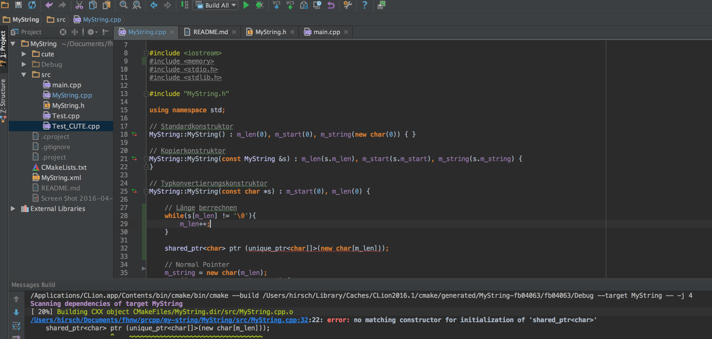
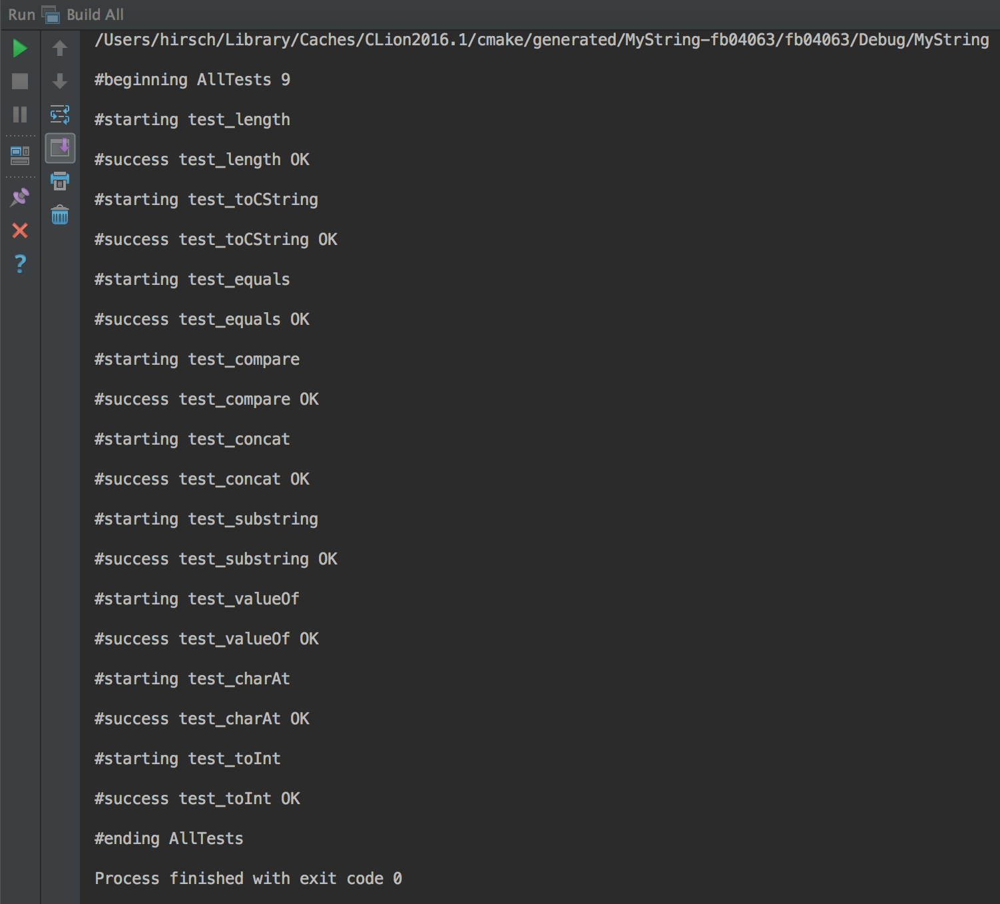

# prcpp-my-string
String Class in C++. Exercise from FHNW.

## Compiler Error
Unfortunately I could not use the following code, because I am working with the libc++ compiler.
```
m_string = shared_ptr<char>(unique_ptr<char[]>(new char[m_len]));
```



## Tests

